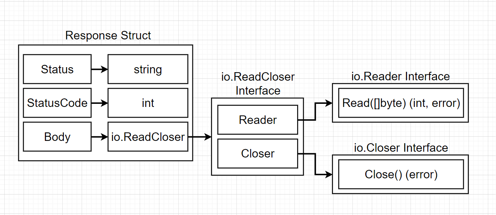
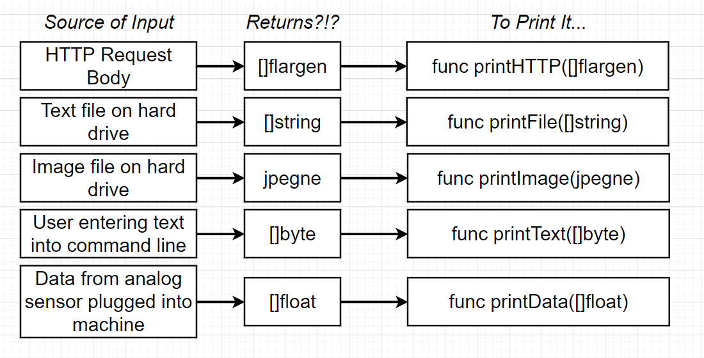
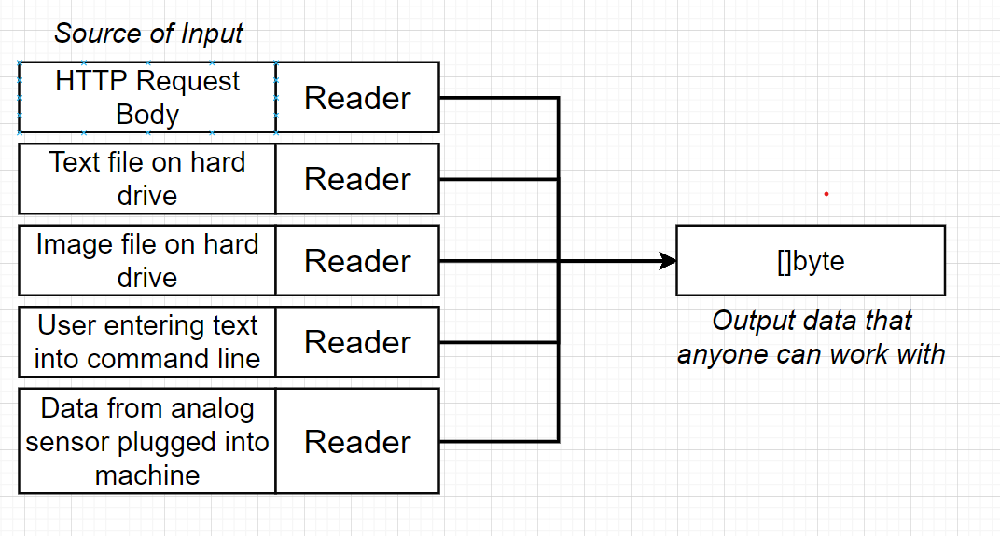
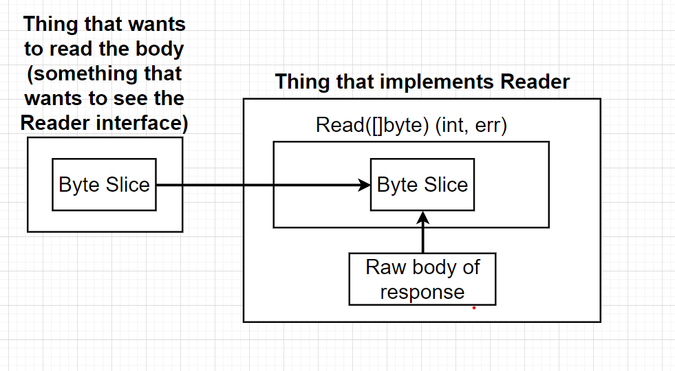
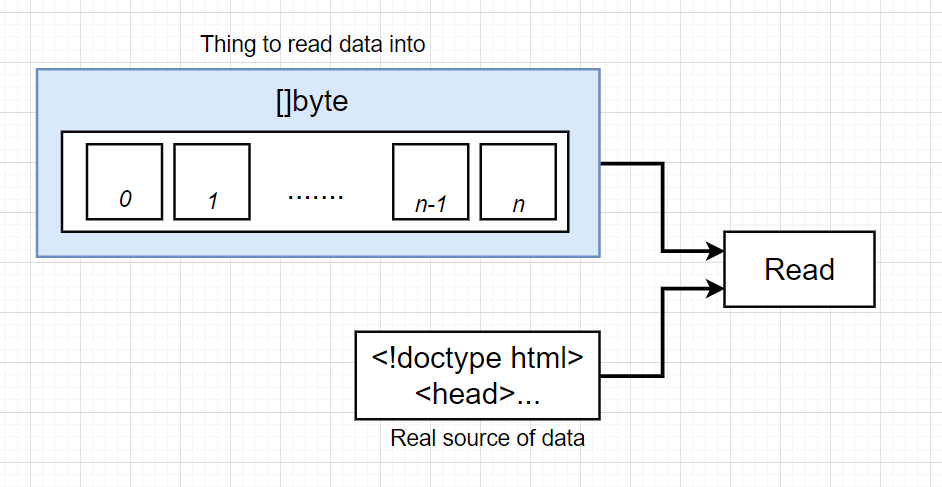
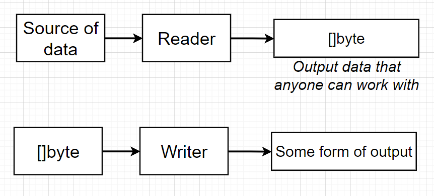
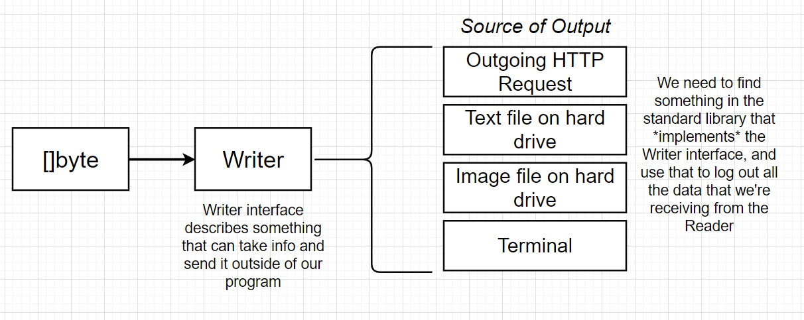
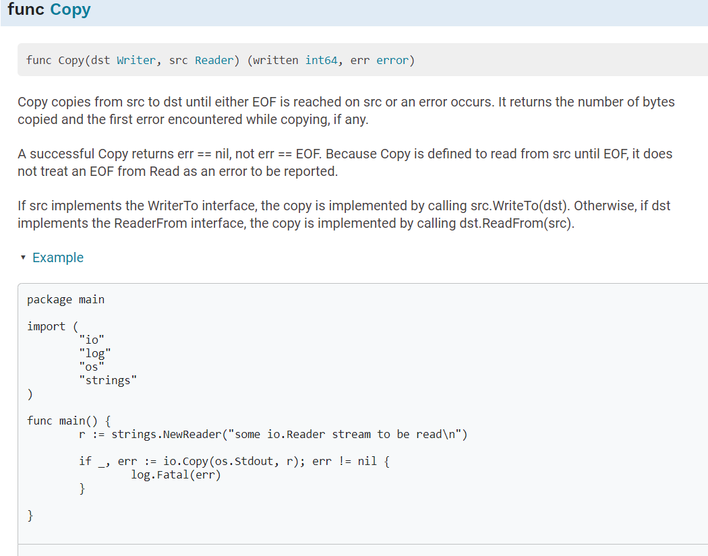
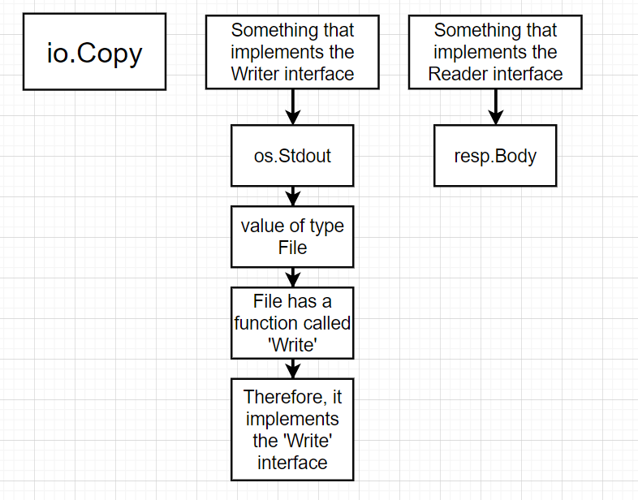

## Interfaces

We can create interfaces and reuse it to create another interfaces
eg interface ReadCloser, ReadSeeker

We can freely embedd one interface to another

    package main

    import (
        "fmt"
        "net/http"
        "os"
    )

    func main() {
	res, err := http.Get("https://jsonplaceholder.typicode.com/todos/10")
	if err != nil {
		 fmt.Print("Error:", err)
		 os.Exit(1)
	}
	fmt.Println(res)

    }

	bs := make([]byte, 99999)

	res.Body.Read(bs)

	fmt.Println(string(bs))

we can do this in one line of code

    io.Copy(os.Stdout, res.Body)

Writer interface, we take out byteslice,

To use writer interface, we need to find something that implements the writer interface that use to log our information

Let's look at the Copy function

    io.Copy(os.Stdout, res.Body)

The second arg is Body, which implements Reader interface

os.Stdout implements writer interface

os.Stdout is of type file, which implemnets Write interface

It looks something like this

This is why we get the output

    PS D:\Study\Go\Coursework\Interfaces\http> go run .\main.go
    {
    "userId": 1,
    "id": 10,
    "title": "illo est ratione doloremque quia maiores aut",
    "completed": true
    }

Let's discuss io.Copy function, let's look out the source code of the same to see how it works

    // Copy copies from src to dst until either EOF is reached
    // on src or an error occurs. It returns the number of bytes
    // copied and the first error encountered while copying, if any.
    //
    // A successful Copy returns err == nil, not err == EOF.
    // Because Copy is defined to read from src until EOF, it does
    // not treat an EOF from Read as an error to be reported.
    //
    // If src implements the WriterTo interface,
    // the copy is implemented by calling src.WriteTo(dst).
    // Otherwise, if dst implements the ReaderFrom interface,
    // the copy is implemented by calling dst.ReadFrom(src).
    func Copy(dst Writer, src Reader) (written int64, err error) {
        return copyBuffer(dst, src, nil)
    }

    // copyBuffer is the actual implementation of Copy and CopyBuffer.
    // if buf is nil, one is allocated.
    func copyBuffer(dst Writer, src Reader, buf []byte) (written int64, err error) {
        // If the reader has a WriteTo method, use it to do the copy.
        // Avoids an allocation and a copy.
        if wt, ok := src.(WriterTo); ok {
            return wt.WriteTo(dst)
        }
        // Similarly, if the writer has a ReadFrom method, use it to do the copy.
        if rt, ok := dst.(ReaderFrom); ok {
            return rt.ReadFrom(src)
        }
        if buf == nil {
            size := 32 * 1024
            if l, ok := src.(*LimitedReader); ok && int64(size) > l.N {
                if l.N < 1 {
                    size = 1
                } else {
                    size = int(l.N)
                }
            }
            buf = make([]byte, size)
        }

This is where it is happening, basically Reading and the writing at the destination

        for {
            nr, er := src.Read(buf)
            if nr > 0 {
                nw, ew := dst.Write(buf[0:nr])
                if nw < 0 || nr < nw {
                    nw = 0
                    if ew == nil {
                        ew = errInvalidWrite
                    }
                }
                written += int64(nw)
                if ew != nil {
                    err = ew
                    break
                }
                if nr != nw {
                    err = ErrShortWrite
                    break
                }
            }
            if er != nil {
                if er != EOF {
                    err = er
                }
                break
            }
        }
        return written, err
    }

### Custom Type

    package main

    import (
        "fmt"
        "io"
        "net/http"
        "os"
    )

    type logWriter struct{}

    func main() {
        res, err := http.Get("https://jsonplaceholder.typicode.com/todos/10")
        if err != nil {
            fmt.Print("Error:", err)
            os.Exit(1)
        }
        lw := logWriter{}
        io.Copy(lw, res.Body)
    }

Remember, just defining the function and associating with logWriter
The logWriter is implementing Writer interface

    func (logWriter) Write(bs []byte) (int, error) {
        fmt.Println(string(bs))
	    fmt.Println("Just wrote these many bytes:", len(bs))
	    return len(bs), nil
    }

But remember, all this interface stuff is like a loose suggestion to just help us figure out what functions
and what types match up where.

But if we still put together a junk or crap implementation that doesn't actually work or doesn't do
the right thing, everything's still going to compile and it's still going to run.

But our program is probably not going to do what it actually is intended to do.
So these interface things are like a contract that help us manage all the types, and they don't necessarily require us to actually write code that makes our application truly work the way we expect.

So just to prove that to you, let's compile and run this application and see what happens. So I'll go back over my terminal.

We'll do our go run main.go and you'll notice just absolutely nothing happens here, OK?

Eventually it returns.

And so as far as you and I are concerned, well, the program compiled successfully ran, but clearly

it did not actually do the right thing.

So remember, interfaces are to help guide you down the right path, but they don't necessarily make sure that you write exactly correct code.

All right.

So now back on track.

Let's make sure that we actually do this thing correctly.

So we're going to put together an implementation inside of.

Right.

That actually takes all the data inside this byte slice and prints it out to the command line.

So we're going to say format, dot, print line.

We're going to take that byte slice, turn it into a string.

So we'll say string, byte, slice like so, and then we'll return an integer in an error.

But this time we're going to return the correct values.

And so this is where you really start to have to read the documentation around the writer interface.

So if we go back to our documentation, you'll notice that this integer number right here is supposed

to return the number of bytes that was written from the byte slice or that argument p so they're calling

the byte slice here.