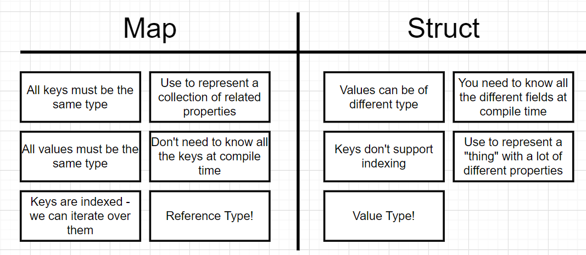

## Maps

The keys has to be of the same type.

the values has to be of the same type.

It is similar to dict in python and Object in JavaScript.

    import "fmt"

    func main() {
	colors := map[string]string{
		"red":   "#ff00000",
		"green": "#4bf745",
	}

	fmt.Println(colors)

Output is 

    map[green:#4bf745 red:#ff00000]

Other way to declare

	var colors map[string]string
	fmt.Println(colors)

And one more other delcaration is

    colors := make(map[string]string)

output will be 

    map[]

We can add into the map

    colors := make(map[string]string)
	colors["white"] = "#ffffff"

We have to use the key to get the value with the above syntax
The reason is, all the keys inside the maps are tight
They has to be of appropriate type. If we said our map is of type int, we could say

    colors[10] = "#0000"

### delete function

    delete(colors, "white")

## Iterate Over a Map

    for color, code := range colors {
		fmt.Println("Hex code for", color, "is ", code)
	}

# Difference in Struct and Map

